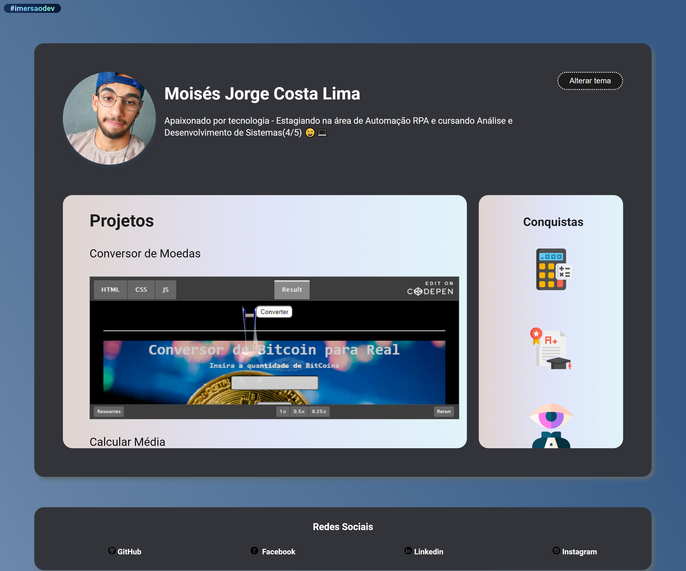

# Portfolio-Imersaodev

Na última aula foi proposto o projeto do portfólio, cujo junta/incorpora os projetos e desafios feitos no [codepen](https://codepen.io/) nesta página, durante a imersaodev da Alura 
  

